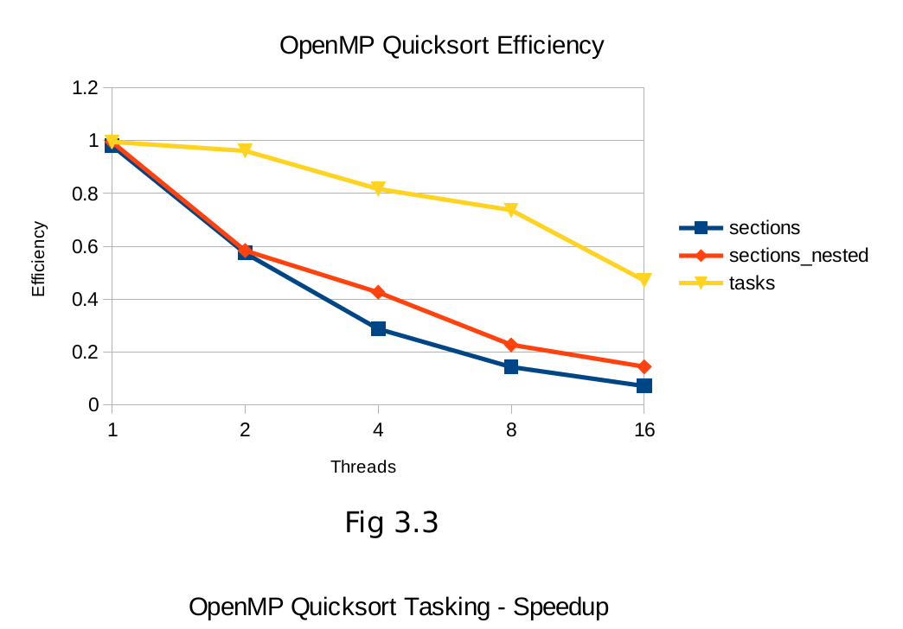

# Exploiting Task-Level Parallelism with OpenMP on Shared Memory Systems
### Author
**Andrew Vaillancourt**

## Table of Contents
- [Abstract](#abstract)
- [1. Introduction](#1-introduction)
- [2. Background](#2-background)
  * [2.1 OpenMP sections pragma](#21-openmp-sections-pragma)
  * [2.2 OpenMP tasks pragma](#22-openmp-tasks-pragma)
- [3. Mergesort and Quicksort](#3-mergesort-and-quicksort)
  * [3.1 Mergesort](#31-mergesort)
- [4. Experimental Setup](#4-experimental-setup)
  * [4.1 Implementation Discussion](#41-implementation-discussion)
- [5. Results](#5-results)
  * [5.1 Mergesort Results](#51-mergesort-results)
  * [5.2 Quicksort Results](#52-quicksort-results)
  * [5.3 Figures](#53-figures)
- [6. Conclusion](#6-conclusion)
- [7. Future Work](#7-future-work)
- [9. References](#9-references)
- [Code](#code)
  * [Run](#run)
  * [Scripts](#scripts)
  * [Clean](#clean)
    + [Other Codes](#other-codes)
- [License](#license)

## Abstract
  OpenMP is a well known application programming interface for exploiting structured parallelism in computationally heavy applications on shared memory systems. However, as applications become more complex, the need for exploiting unstructured and dynamic parallelism increases. Prior to OpenMP 3.0 this task-level parallelism was expressed using the section model. OpenMP 3.0 introduced the tasking model which promised a more natural way of exploiting and expressing irregular algorithms. This paper examines the performance, scalability, and expressiveness of the two models through the implementation of the well-understood divide-and-conquer sorting algorithms Mergesort and Quicksort. 
    
## 1. Introduction
  Well designed task-parallel programming models offer an efficient way for  programmers to specify parallel tasks naturally, in a manner that can scale with problem size. This scheduling of tasks onto processors can either be performed statically at compile time, dynamically at run-time, or some blend of the two. Task parallelism is well suited to the expression of nested parallelism in recursive divide-and-conquer algorithms and of unstructured parallelism in irregular computations. OpenMP is one such framework for developing task-parallel algorithms. There are 2 main models for implementing task-parallel programs in OpenMP: statically, through the use of the sections construct, or dynamically using the more recent addition to the OpenMP specification known as tasking. This paper will explore a comparison of both models on two well known recursive, divide-and-conquer sorting algorithms: Mergesort and Quicksort. Execution time, scalability, efficiency as well as programmer productivity will all be considered when assessing the two programming models provided by OpenMP.
  
## 2. Background
  OpenMP is a set of compiler directives and callable runtime library routines that extend C (as well as C++ and Fortran) to express shared-memory parallelism [1]. The standard view of parallelism in a shared-memory program is fork/join parallelism [2]. When the program begins execution, only a single thread (master thread)  is active. The master thread executes the sequential portions of the program, and when parallelism can be exploited, the master thread forks additional threads to share the work. At the end of a parallel region, the additional created threads are suspended or killed and the program flow control returns to the master thread.  This is known as a join. In OpenMP, all threads have access to the same shared global memory and each thread has access to its own, private, local memory. Threads synchronize implicitly by reading and writing shared variables. No explicit communication is needed between threads [6]. 

### 2.1 OpenMP `sections` pragma
  Prior to OpenMP 3.0, work-sharing, beyond simple loop level parallelism, was accomplished by using the sections construct. The sections pragma is a non-iterative work-sharing construct that contains a set of structured blocks that are to be distributed among and executed by the threads in a team [3]. Each structured block, declared using a sections pragma, is executed once by one of the threads in the team [3]. The OpenMP `sections` pragma is used in conjunction with the OpenMP section pragma to indicate static regions of computation that can be simultaneously executed on different threads of an OpenMP parallel region [4]. Each unit of independent work must be specified in a section pragma, immediately following a sections construct. This static method of specifying parallel sections at compile time limits the level of parallelism to that of the number of sections clauses contained within a sections region. The threads of a parallel region that are not assigned to a section must wait at an implicit barrier at the end of a sections region until the sections threads have completed their work which significantly limits the scalability of such designs. In the following study of Mergesort and Quicksort, we will discuss how this limitation can be remedied to some degree by enabling and utilizing nested parallelism in the recursive algorithms.

### 2.2 OpenMP `tasks` pragma
  OpenMP 3.0 introduced a new feature called tasking.  Tasking allows for the parallelization of applications where units of work are generated dynamically, such as in recursive structures or while loops, without having to rely on nested parallelism [3]. This simplifies the logic for the programmer as well as reduces the overhead inherent in creating multiple, nested, parallel regions [5]. Rather than organizing all tasks into their own groups like in sections, tasking allows for more unstructured parallelism, as when a task pragma is encountered by a thread in a parallel region, it is placed into a task queue and can be executed by a thread as soon  as one becomes available. The scheduling of tasks, which each contain the code to execute, the task data environment, and internal control variables, to threads, is handled by the OpenMP runtime system [6]. The initial creation of tasks is often handled by a single thread as will be shown in the discussion of the sorting implementations to follow. Synchronization between tasks is achieved using the taskwait pragma. This construct specifies a wait on the completion of child tasks generated since the beginning of the current task and allows for synchronization between dependent tasks[7].

## 3. Mergesort and Quicksort
  Mergesort and quicksort are well understood divide-and-conquer sorting algorithms which are well suited to the demonstration of task-level parallelization techniques in OpenMP, using both sections and tasking. This paper is not a discussion on the best design for these sorting algorithms, but rather uses the divide-and-conquer algorithms as a way of assessing the separate task-level parallelization models of OpenMP. Care was taken to modify the sorting algorithms minimally between models to fairly demonstrate and assess the performance and ease of implementation of the different OpenMP task-parallel  models. However, in some sense, tasking naturally prefers to be unnested, whereas the sections model will need to be nested in order to achieve any scalability, so various implementations were also made so each model could be expressed in a way most natural.
  
  ### 3.1 Mergesort
  Conceptually, a merge sort works as follows: 
  1. Divide the unsorted list into 2 halves.
  2. Call mergesort recursively on each of the halves and then merge each of the sorted halves.
  
  A serial implementation in C looks like:
  ```c
  void mergesort_serial(int a[], int n, int temp[]) {
    mergesort_serial(a, n/2, temp);
    mergesort_serial(a + n/2, n - n/2, temp);
    merge(a, n, temp);
}
  ```
A parallel implementation in OpenMP using sections looks like this:
```c
void mergesort_parallel
      (int a[], int n, int temp[], int thrds){
    if ( threads == 1) {
        mergesort_serial(a, n, temp);
    }
    else if (threads > 1) {
    #pragma omp parallel sections
        {
     #pragma omp section
      mergesort_parallel(a, n/2,temp,thrds/2);
     #pragma omp section
      mergesort_parallel(a + n/2, n - n/2,
                temp + n/2, thrds - thrds/2);
        }
    merge(a, size, temp);
    }
}
```   
  Note the parallel clause preceding the sections directive. Since this function is called recursively, a new parallel region is created in each call. This is known as nested parallelism and allows this algorithm to scale to the number of hardware threads available on the machine. The OMP_NESTED environment variable must be set to enable nested parallelism. The number of available threads must be kept track of which is why the remaining thread count is halved on each level of the call tree. Without this depth checking, an error will likely be thrown due to the high number of requested threads in the nested parallel region which the machine cannot accommodate.
    
  Although the tasking variation can be implemented without nested parallelism, (as tasks can simply be created and added to the task queue in each recursive call, with the parallel region declared outside the initial sort function call,) it was decided that the tasking and section models should first be compared under similar conditions to determine if the dynamic nature of task scheduling has any benefit.

A parallel mergesort using OpenMP tasking looks like:
```c
void mergesort_parallel(int a[], int n, temp[], int thrds, int thresh) {
  if (threads == 1) {
    mergesort_serial(a, n, temp, thresh);
  }
  else if (threads > 1) {
    #pragma omp parallel
    {
      #pragma omp single nowait
      {
        #pragma omp task
        {
          mergesort_par(a, n / 2, temp, thrds/2, thresh);
        }
        #pragma omp task
        {
          mergesort_parallel_omp(a + size / 2, n - n / 2,
          temp + n/2, thrds – thrds / 	2,thresh);
        }
          if (p < r) {
    int q = partition (p, r, data);
    #pragma omp task firstprivate(data, low_limit, r, q)
      quick_sort (p, q - 1, data, low_limit);
    #pragma omp task firstprivate(data, low_limit, r, q)
     quick_sort (q + 1, r, data, low_limit);
  }
}

void par_quick_sort (int n, int *data, int low_limit) {
  #pragma omp parallel
  {
    #pragma omp single nowait
      quick_sort (0, n, data, low_limit);
  }
}
```
  Note the two separate functions. The main function will call par_quick_sort() which creates a single parallel region and has a single thread call quick_sort() which then generates the initial tasks. These tasks then generate  child tasks  recursively until the list is sorted. See how nested parallelism is not a requirement to achieve  full thread utilization. A single parallel region is created with all available system threads and tasks wil be assigned to the threads as they are created. Since the sort is done in place, each task or section needs its own copy of the data which is why the firstprivate clause is used. 

## 4. Experimental Setup
  All experiments were run with the same array of 2^30 random integers on an AMD Ryzen 7-1700 8-core machine with 16 available hardware threads.
### 4.1 Implementation Discussion
  Mergesort uses a partition size threshold of 32 for switching to insertion sort, with depth checking to determine when to switch to serial mergesort. Quicksort’s threshold was used only to determine when to switch to serial quicksort. This paper is interested only in the comparison of tasking vs sections under similar algorithms, rather than a comparison of the 2 sorting algorithms themselves. Performance results presented here are meant as a preliminary analysis of the performance of the 2 models under 2 different divide-and-conquer scenarios, balanced and unbalanced partitioning. Future work will add more variations to the implementations for deeper analysis.

Mergesort was run with four different implementations:
- Sections: no nesting of parallel regions – only utilizes 2 threads as described previously
- Sections: nested parallel regions – with depth checking to limit depth.
- Tasking: nested parallel regions – with depth check
- Tasking: no nesting – with depth check to limit task levels

Quicksort was run with three different implementations:
- Sections: no nesting of parallel regions – only utilizes 2 threads as described previously.
- Sections: nested parallel regions – with depth checking to limit depth, but allow for utilization of all hardware threads.
- Tasking: no nesting – no depth checking
  - This is the most natural way of expressing Quicksort via the OpenMP tasking model and makes for the simplest programming logic out of the three different implementations.

It is important to remember that the depth checking is needed for the ability to run the nested sections versions, and that nesting the parallel regions is the only way to utilize more than 2 threads if using sections in the case of these sorting algorithms. Tasking needs no such checking to operate correctly.

## 5. Results

As expected, Fig2.1 and 2.2 clearly show the
scalability limitation of unnested sections for binary
divide and conquer algorithms. Beyond two threads,
the two static sections cannot exploit anymore
parallelism and performance gains level off.

### 5.1 Mergesort Results
Mergesort showed little variation in the performance
between nested sections and tasking. This is likely due
to the fact that mergesort is a naturally balanced
algorithm, so the dynamic nature of tasks cannot be
fully profited from. Any benefits from threads
completing early and being able to start new work is
offset by the higher overhead of the task queuing and
scheduling.

### 5.2 Quicksort Results
Quicksort shows a much starker contrast between
OpenMP’s two task-level parallelism models, with tasks
out-performing nested-sections significantly. The
varying partition sizes will lead to some threads
completing their portion of the sort much quicker,
which can be exploited by scheduling new tasks to the
completed threads in the tasking model. Efficiency (fig
2.3, 3.3) in all algorithms tapers off to a similar degree
as the overhead of creating and managing more nested
regions and thread scheduling becomes more costly.

### 5.3 Figures





## 6. Conclusion
Based on these results, it would appear that the
addition of the tasking model is an improvement to
OpenMP, both in terms of performance and
programmer productivity. Problems can be expressed
more elegantly using the tasking model, without the
need to create complex nested regions and manually
maintain a count of recursion depth level. Beyond the
programming simplification, performance can clearly
be gained in irregular algorithms that exhibit some
load imbalance. The queuing nature of tasks is well
suited to maximizing thread utilization under these
conditions. Tasks also have the added benefit of
perfect scaling (fig 3.4) as any number of threads can
be utilized. Sections with depth checking, in the case
of these binary recursion trees, requires the number of
threads to be a power of 2 for speedup to occur.

## 7. Future Work
Although this work was a good preliminary
introduction to the tasking model of OpenMP, there
are many other parameters and runtime variables
which can be explored in OpenMP. The sorting
algorithms themselves can also be developed further,
experimenting with different thresholds for serial
cutoff etc. In some cases trying to keep a similar
design
between
the sections
and
tasking
implementations may have had an effect on the results,
as these models naturally want to be expressed
differently programmatically. Experimenting with
different array sizes may also be useful in determining
if the over head of task scheduling has a negative
impact on performance for sorting smaller lists.
Profiling tools such as Intel V-Tune[8] and Oracle
Developer Studio[9] can also be used for a detailed
view of thread utilization, offering more insight into
the results shown in this paper.

## 9. References
[1] Nersc, “OpenMP Resources¶,” User Documentation.
[Online]. Available:
https://docs.nersc.gov/programming/programming-models/op
enmp/openmp-resources/. [Accessed: 10-Apr-2019].

[2] A. Marowka, "Think Parallel: Teaching Parallel
Programming Today", IEEE Distributed Systems Online, vol.
9, no. 8, pp. 1-1, 2008. Available: 10.1109/mdso.2008.24.

[3] Openmp.org, 2019. [Online]. Available:
https://www.openmp.org/wp-content/uploads/spec30.pdf.
[Accessed: 10- Apr- 2019].

[4] S. Shah, G. Haab, P. Petersen and J. Throop, "Flexible
control structures for parallelism in OpenMP", Concurrency:
Practice and Experience, vol. 12, no. 12, pp. 1219-1239,
2000. Available: 10.1002/1096-
9128(200010)12:12<1219::aid-cpe530>3.0.co;2-0.

[5] "Chapter 5 Tasking (Sun Studio 12 Update 1: OpenMP
API User's Guide)", Docs.oracle.com, 2019. [Online].
Available: https://docs.oracle.com/cd/E19205-01/820-
7883/6nj43o69j/index.html. [Accessed: 1- Apr- 2019].

[6] "OpenMP Task Scheduling Analysis via OpenMP
Runtime API and Tool Visualization - IEEE Conference
Publication", Ieeexplore.ieee.org, 2019. [Online]. Available:
https://ieeexplore.ieee.org/document/6969496. [Accessed:
11- Apr- 2019].

[7] Openmp.org, 2019. [Online]. Available:
https://www.openmp.org/wp-content/uploads/OpenMP3.0-
SummarySpec.pdf. [Accessed: 10- Apr- 2019].

[8] "OpenMP* Code Analysis Method", Software.intel.com,
2019. [Online]. Available:
https://software.intel.com/en-us/vtune-amplifier-cookbook-
openmp-code-analysis-method. [Accessed: 14- Apr- 2019].

[9] "Profiling OpenMP Applications with the Oracle
Developer Studio Performance Tools", Oracle.com, 2019.
[Online]. Available:
https://www.oracle.com/technetwork/articles/servers-storage-
dev/profiling-openmp-studio-perf-2293555.html. [Accessed:
14- Apr- 2019].

[10] "Merge sort", En.wikipedia.org, 2019. [Online].
Available: https://en.wikipedia.org/wiki/Merge_sort#/media/
File:Merge_sort_algorithm_diagram.svg. [Accessed: 4- Apr-
2019]


## Code
### Run

`$ make`

`$ ./<program-name> <array_size> <threshold> <num_threads>`

Except for serial versions which do not have `<num_threads>`.


### Scripts

There are 2 included scripts:

- `run-single-pgm-tests.sh`: runs tests for a single program only, specify which program manually in the script.

- `clear-results.sh`: removes all test output files from results directories.


### Clean

`$ make clean`


#### Other Codes

The directory `other_codes` contains codes developed but not discussed in report.

## License
MIT

